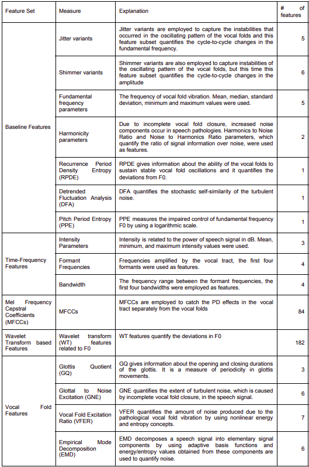

# Parkinsons-Disease-Detection

The objective of this project is to detect **Parkinson's Disease** as accurately as possible based on data from the patients voices.

In the recent years, the use of remote control and detection systems to diagnose Parkinson's disease, based on the measurement of motor dysfunction in the cerebral cortex has increased. About 90% of patients show signs of speech problems in the early stages of the disease. Therefore, voice analysis and processing can be a good way to diagnose the disease early on. 

The project's dataset includes features extracted from the voices of 188 Parkinson's patients (107 males and 81 females) and 64 healthy individuals (23 males and 41 females). Different feature extraction algorithms are applied to the collected sounds to obtain appropriate clinical information for the diagnosis of Parkinson's disease. A brief description of the features is brought in the following table:

Different methods of feature engineering as well as classification models were tested to find the best fit for the data, which I will list bellow:

## Feature Engineering Methods
1. PCA
2. LDA (Linear Discriminant Analysis)
3. ICA
4. Autoencoders
5. Backward Elimination (combined with KNN)

## Classifier Methods
For the classification both **Generative** and **Discriminative** methods were tested which I will be listing them bellow.
### Generative Models
1. Guassian Mixture Model
2. Parzen Window Bayesian Classifier

### Discriminative Models
1. Logistic Regression
2. Decision Tree
3. SVM (with linear kernel)
4. KNN
5. MLP
6. RBF

### Ensemble Methods
After testing each model, the best one's according to the reported metrics were selected to be used in **Ensemble Methods** to hopefully get better predictions. Three types of ensemble methods were used which are listed bellow:
- **Bagging Method**
- **Voting**
- **Boosting Method**

In the end the best classifier is reported and its hyperparameters are tuned to achieve best results.

## Metrics
For each classifier the following metrics are reported:
1. F1-score
2. Precision
3. Recall
4. AUC
5. ROC curve
6. Confusion Matrix
